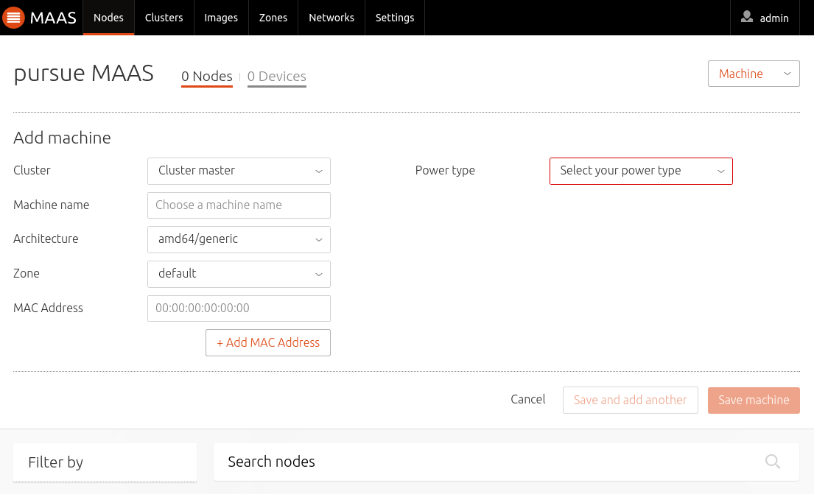

Title: Add Nodes
TODO: KVM stuff needs to be integrated better into this page
      Verify instructions re adding a node manually


# Add Nodes

Adding a node to MAAS is typically done via a combination of DHCP (and TFTP),
which should, by now, be enabled in your MAAS environment, and PXE, which you
tell the system in question to use when it boots. This unattended manner of
adding a node is called *enlistment*.

!!! Note: Configuring a computer to boot over PXE is done via its BIOS and is
often referred to as "netboot" or "network boot".

If enlistment doesn't work for you it is possible to
[add a node manually](#add-a-node-manually).

Regardless of how a node is added, there are no special requirements for the
underlying machine. In particular, there is no need to install an operating
system on it.

Once MAAS is working to the point of adding nodes it is important to
understand [node statuses](intro-concepts.md#node-statuses) and
[node actions](intro-concepts.md#node-actions).

Typically, the next step will be to *commission* the node. See
[Commission nodes](installconfig-commission-nodes.md)).


## Enlistment

As explained, to enlist, the underlying machine needs to be configured to
netboot. Such a machine will:

1. Contact a DHCP server
1. Receive an image over TFTP and boot from it
1. Contact the MAAS server
1. Shut down

During this process, the MAAS server will be passed information about the node,
including the architecture, MAC address and other details which will be stored
in the database. This information-gathering process is known as *automatic
discovery*.


## KVM guest nodes

KVM-backed nodes are common and so a little extra guidance is provided here.
Begin by ensuring the `virsh` binary is available to the rack controller via
the `libvirt-bin` package.

The 'maas' user will need an SSH keypair (with a null passphrase) so MAAS will
be able to query and manage KVM guests remotely. A login shell will also be
useful when becoming user 'maas':

```bash
sudo chsh -s /bin/bash maas
sudo su - maas
ssh-keygen -f ~/.ssh/id_rsa -N ''
```

Add the public key to `/ubuntu/.ssh/authorized_keys` on the KVM host:

```bash
ssh-copy-id -i ~/.ssh/id_rsa <USER>@<KVM_HOST>
```

!!! Note: You may need to (temporarily) configure sshd on the KVM host to
honour password authentication for the `ssh-copy-id` command to succeed.

Still as user 'maas', test connecting to the KVM host with virsh (use
appropriate values for USER and KVM_HOST):

```bash
virsh -c qemu+ssh://<USER>@<KVM_HOST>/system list --all
```

This should work seamlessly because the private key is passphraseless.

Exit from the user 'maas' shell:

```bash
exit
```

See
[KVM/virsh power type example](installconfig-power-types.md#example:-virsh-(kvm)-power-type).


## Add a node manually

If you know the MAC address of a node, you can manually enter details about
the node through the web interface. Click the `Add Node` button to be taken to
the "Add Node" form:



<!-- MAYBE THIS CAN BE USED LATER

->>
