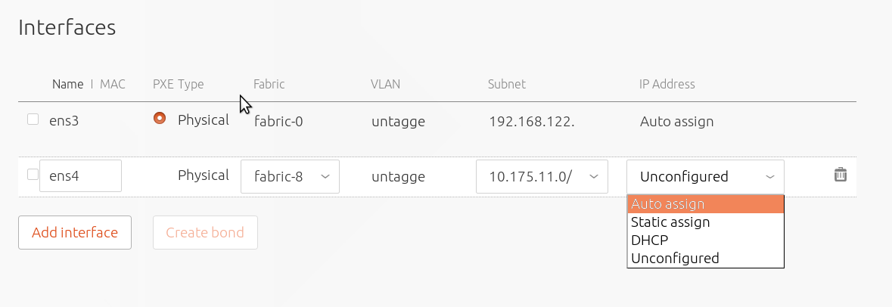

Title: Commission Nodes | MAAS
TODO:  Add CLI for IP address assignment methods
       Add CLI for image/kernel to use for commissioning (?)
       Explain web UI checkboxes: 'Allow SSH access', 'Retain network configuration' and 'Retain storage configuration'
       Why can't enlistment and commissioning be combined into one step? This need to be clarified (is it network interface attach/configure?)

# Commission Nodes

Once a node is [added to MAAS](installconfig-add-nodes.md) the next logical
step is to *commission* it.

To commission, the underlying machine needs to be configured to netboot (this
should already have been done during the enlistment stage). Such a machine will
undergo the following process:

1. DHCP server is contacted
1. kernel and initrd are received over TFTP
1. machine boots
1. initrd mounts a Squashfs image ephemerally over iSCSI
1. cloud-init runs commissioning scripts
1. machine shuts down

The commissioning scripts will talk to the region API server to ensure that
everything is in order and that eventual deployment will succeed.

The image used is, by default, the latest Ubuntu LTS release and should not
require changing. However, it can be configured in the web UI in the 'Settings'
page.

To commission a node, select it and choose 'Commission' under the 'Take action'
dropdown menu (orange button).

You have the option of selecting some extra parameters (checkboxes). Then
finalize the directive by hitting 'Go'.

While a node is commissioning its status will change to *Commissioning*. 

See [MAAS CLI](manage-cli-common.md#commission-all-machines) for how to
commission all machines with the 'New' status.

!!! Note: If your node has more than one network interface you may need to tell
MAAS which one to use. Do this by marking it *Broken* (see next section).

Once a node is commissioned its status will change to *Ready*. Consider taking
this time to [tag your node](installconfig-tags.md).

The next step will be to *deploy* it. See
[Deploy nodes](installconfig-deploy-nodes.md).

## Post-commission configuration

Once a node has been commissioned, its network interface(s) can be configured.
Specifically, when a node's status is either 'Ready' or 'Broken', interfaces
can be added/removed, attached to a fabric and linked to a subnet, and provided
an IP assignment mode. 

There are four modes to choose from that determine how an address on the subnet
gets assigned when the node is eventually deployed:

- **Auto assign** MAAS will assign a random static address 
  (`iface eth0 inet static`) from among the addresses that do not fall within a
  *reserved dynamic range* or a *reserved range*.

- **Static assign** The administrator will specify a static address using a
  secondary field.

- **DHCP** A dynamic address will be leased via either MAAS-managed DHCP or an
  external DHCP server.

- **Unconfigured** The interface will be left unconfigured.

See [Concepts and terms](intro-concepts.md#ip-ranges) for the definitions of
reserved range types used in MAAS.
