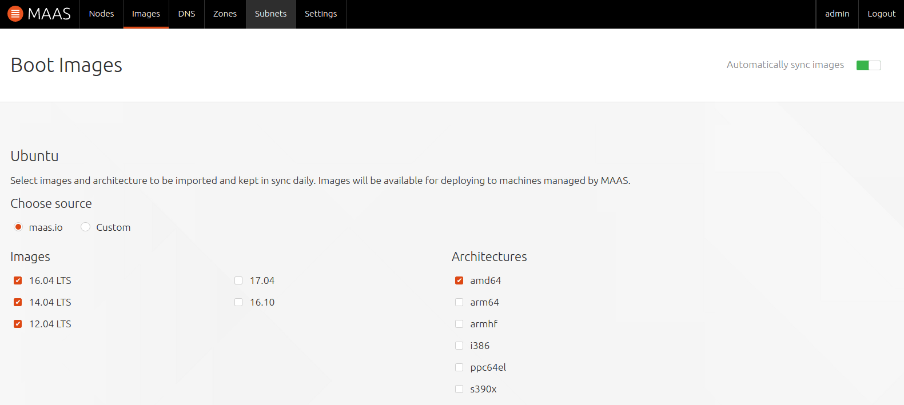

Title: Select and Import Images | MAAS 
TODO:  Be consistent with final version of installconfig-hwe-kernels.md (see TODO)
       There is rumor of changing the image sync frequency. 1 hr is deemed too frequent

# Select and Import Images

This page explains how to select and import the images that MAAS requires in
order to provision its nodes.

Note that the MAAS CLI can also be used for image management. You must
[Select images](manage-cli-images.md#select-images) and 
[Import newly-selected images](manage-cli-images.md#import-newly-selected-images).

On the Images page, you will see, by default, the three most recent Ubuntu LTS
releases (and amd64 architecture) are selected:

In the top-right corner there is a toggle switch for automatic syncing of
images. It is highly recommended to keep this enabled.

!!! Note: Image sync occurs hourly and the availability of new images is
influenced by the image stream MAAS is configured to use. See
[Boot image sources](installconfig-images.md#boot-image-sources).

To change the selections select any other images (by choosing 'Release' and
'Architecture'), and click the 'Save selection' button to initiate the import.
Existing images will be shown in addition to the newly selected ones. The
latter will have their status updated as the import is processed:

To remove an image, simply unselect it and click 'Save selection'.

## Other images

It is also possible to import and provision images other than Ubuntu. Images
supported and provided by MAAS will appear beneath the 'Other Images' section.
Currently, images for both CentOS 6.6 and CentOS 7.0 are available and these
can be imported and used just like the Ubuntu images above.

## Using a local mirror

Optionally, a local mirror can be set up as the boot source. MAAS will then use
it instead of the standard internet-based server. This will reduce the time
required to complete the image import step significantly. See
[Local image mirror](installconfig-images-mirror.md) for instructions on
doing this.
