Title: Installing MAAS
table_of_contents: True

# Installing MAAS

There are two main ways to install MAAS:

- From a package repository.
- As a fresh install from Ubuntu Server install media. 

## MAAS Packages and Repositories

### MAAS Packages

Installing MAAS from packages is straightforward. There are actually several
packages that go into making up a working MAAS install, but for convenience,
many of these have been gathered into a virtual package called 'maas' which
will install the necessary components for a 'seed cloud', that is a single
server that will directly control a group of nodes. The main packages are:

- `maas` - seed cloud setup, which includes both the region controller and
  the cluster controller below.
- `maas-region-controller` - includes the web UI, API and database.
- `maas-cluster-controller` - controls a group ("cluster") of nodes
  including DHCP management.
- `maas-dhcp`/`maas-dns` - required when managing dhcp/dns.
- `maas-proxy` - required to provide a MAAS proxy.

If you need to separate these services or want to deploy an additional cluster
controller, you should install the corresponding packages individually (see
the description of a typical setup &lt;setup&gt; for more background on how a
typical hardware setup might be arranged).

There are two suggested additional packages 'maas-dhcp' and 'maas-dns'. These
set up MAAS-controlled DHCP and DNS services which greatly simplify deployment
if you are running a typical setup where the MAAS controller can run the
network (Note: These.png*mus.png* be installed if you later set the options in the
web interface to have MAAS manage DHCP/DNS). If you need to integrate your
MAAS setup under an existing DHCP setup, see manual-dhcp

### MAAS Package Repositories

While MAAS is available in the Ubuntu Archives per each release of Ubuntu, the
version might not be the latest. However, if you would like to install a newer
version of MAAS (the latest stable release), this is available in the
following PPA:

- [ppa:maas/stable][maasppastable]

!!! Note: 
    The MAAS team also releases the latest development release of MAAS. The
    development release is available in [ppa:maas/next][maasppanext]. However, this
    is meant to be used for testing and at your own risk.

Adding MAAS package repository is simple. At the command line, type:

```bash
sudo add-apt-repository ppa:maas/stable
```

You will be asked to confirm whether you would like to add this repository, and
its key. Upon configuration, the following needs to be typed at the command
line:

```bash
sudo apt-get update
```

## Installing MAAS from the command line

### Installing a Single Node MAAS

At the command line, type:

```bash
sudo apt-get install maas
```

This will install both the MAAS Region Controller and the MAAS Cluster
Controller, and will select sane defaults for the communication between the
Cluster Controller and the Region Controller. After installation, you can
access the Web Interface. Then, there are just a few more setup steps
post\_install

### Reconfiguring a MAAS Installation

You will see a list of packages and a confirmation message to proceed. The
exact list will obviously depend on what you already have installed on your
server, but expect to add about 200MB of files.

The configuration for the MAAS controller will automatically run and pop up
this config screen:


Here you will need to enter the hostname for where the region controller can
be contacted. In many scenarios, you may be running the region controller
(i.e. the web and API interface) from a different network address, for example
where a server has several network interfaces.

### Adding Cluster Controllers

If you would like to add addtional MAAS Cluster Controllers to your MAAS
setup, you can do so by installing the Cluster Controller in a different
Ubuntu machine. At the command line, type:

```bash
sudo apt-get install maas-cluster-controller
```

Once installed, you will need to input the shared secret, in order to allow
the Cluster Controller to authenticate with the Region Controller. You can
obtain the shared secret from the Region Controller. The shared secret can be
copied from the Region Controller in `var/lib/maas/secret`.

Once you have copied the secret, you can install it in the Cluster Controller.
At the command line, type:

```bash
sudo maas-provision
```

Once installed, you will need to reconfigure the Cluster Controller to
correctly point to the API hostname or IP address of the Region Controller
that's on the same network as the Cluster Controller:

```bash
sudo dpkg-reconfigure maas-cluster-controller
```

The configuration for the MAAS Cluster Controller will automatically run and
pop up this config screen:


Once entered, the MAAS Cluster Controller configuration will request

## Installing MAAS from Ubuntu Server boot media

If you are installing MAAS as part of a fresh install it is easiest to choose
the "Multiple Server install with MAAS" option from the installer and have
pretty much everything set up for you. Boot from the Ubuntu Server media and
you will be greeted with the usual language selection screen:

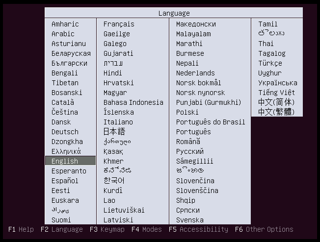

On the next screen, you will see there is an entry in the menu called
"Multiple server install with MAAS". Use the cursor keys to select this and
then press Enter.

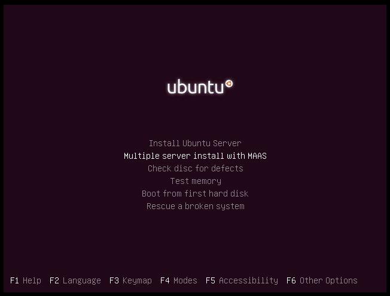

The installer then runs through the usual language and keyboard options. Make
your selections using Tab/Cursor keys/Enter to proceed through the install.
The installer will then load various drivers, which may take a moment or two.

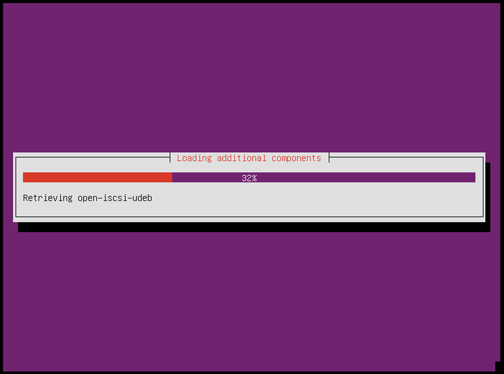

The next screen asks for the hostname for this server. Choose something
appropriate for your network.

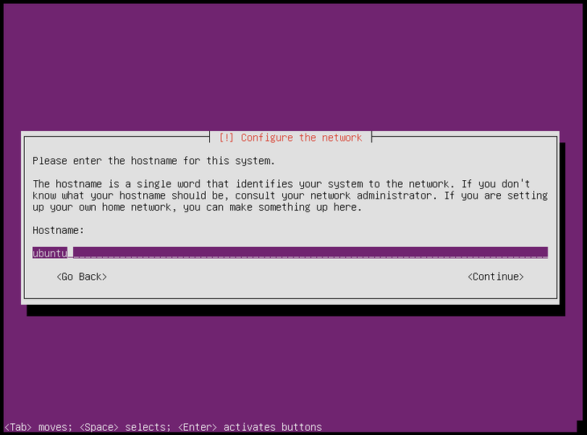

Finally we get to the MAAS part! Here there are just two options. We want to
"Create a new MAAS on this server" so go ahead and choose that one.

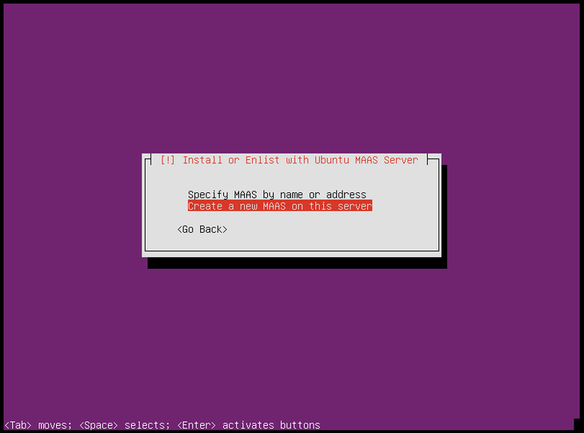

The install now continues as usual. Next you will be prompted to enter a
username. This will be the admin user for the actual server that MAAS will be
running on (not the same as the MAAS admin user!)

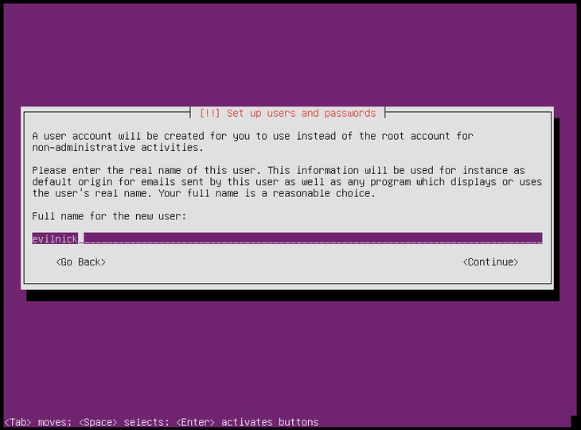

As usual you will have the chance to encrypt your home directory. Continue to
make selections based on whatever settings suit your usage.

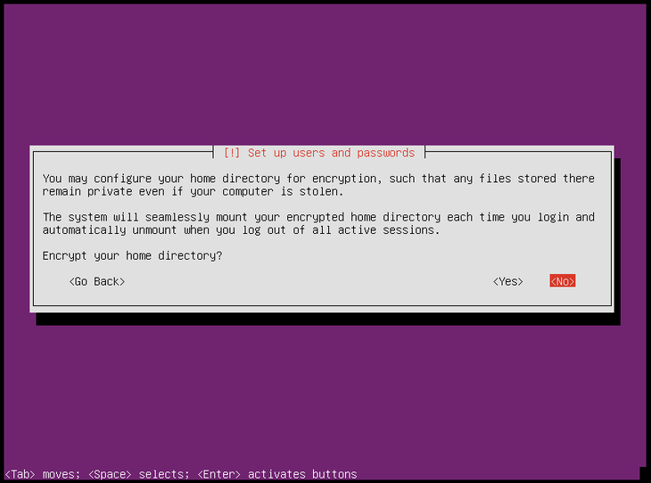

After making selections and partitioning storage, the system software will
start to be installed. This part should only take a few minutes.

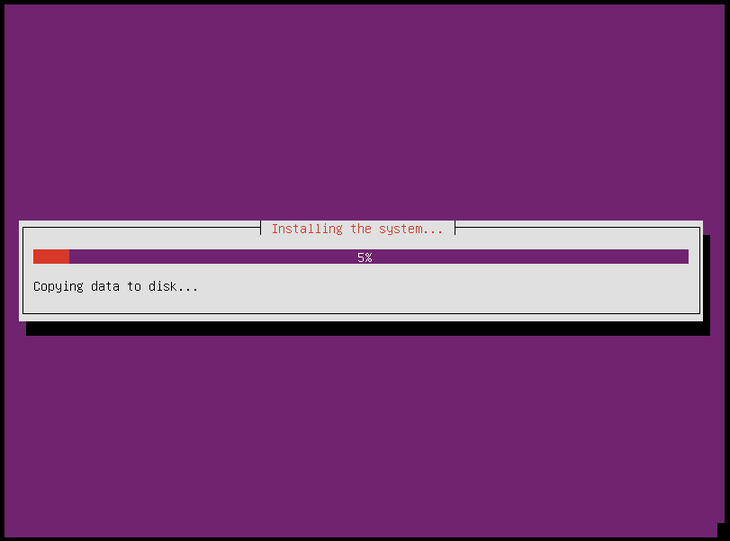

Various packages will now be configured, including the package manager and
update manager. It is important to set these up appropriately so you will
receive timely updates of the MAAS server software, as well as other essential
services that may run on this server.

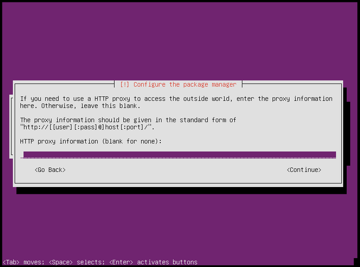

The configuration for MAAS will ask you to configure the host address of the
server. This should be the IP address you will use to connect to the server
(you may have additional interfaces e.g. to run node subnets)


The next screen will confirm the web address that will be used to the web
interface.

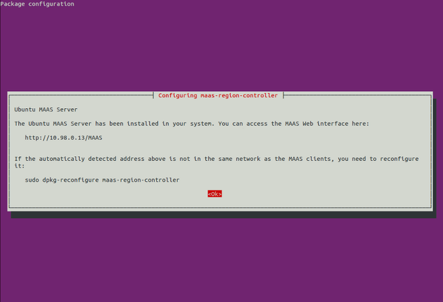

After configuring any other packages the installer will finally come to and
end. At this point you should eject the boot media.

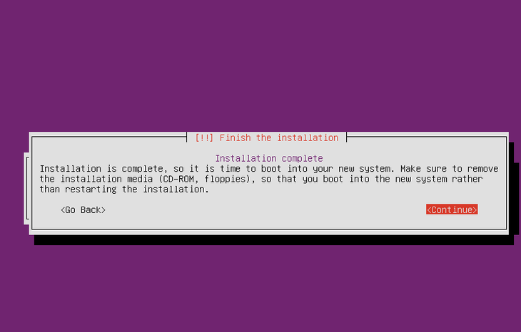

After restarting, you should be able to login to the new server with the
information you supplied during the install. The MAAS software will run
automatically.

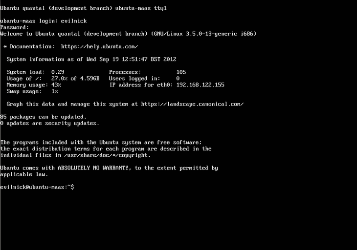

!!! Note: 
    The maas-dhcp and maas-dns packages should be installed by default,
    but on older releases of MAAS they won't be. If you want to have MAAS run DHCP
    and DNS services, you should install these packages. Check whether they are
    installed with:

```bash
dpkg -l maas-dhcp maas-dns
```

If they are missing, then:

```bash
sudo apt-get install maas-dhcp maas-dns
```

And then proceed to the post-install setup below.

# Post-Install tasks

Your MAAS is now installed, but there are a few more things to be done. If you
now use a web browser to connect to the region controller, you should see that
MAAS is running, but there will also be some errors on the screen:

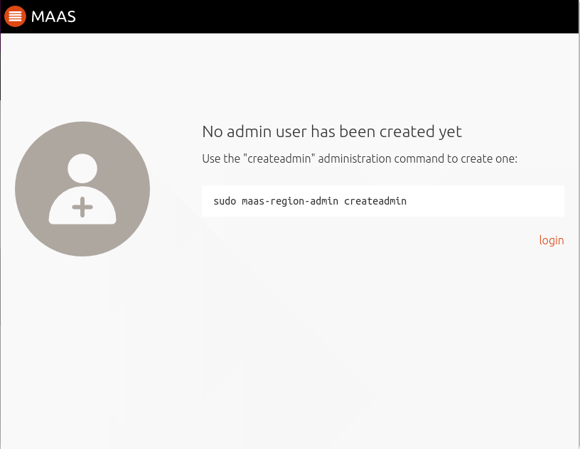

The on screen messages will tell you that there are no boot images present,
and that you can't login because there is no admin user.

## Create a superuser account

Once MAAS is installed, you'll need to create an administrator account:

```bash
sudo maas-region-admin createadmin --username=root --email=MYEMAIL@EXAMPLE.COM
```

Substitute your own email address for <MYEMAIL@EXAMPLE.COM>. You may also use
a different username for your administrator account, but "root" is a common
convention and easy to remember. The command will prompt for a password to
assign to the new user.

You can run this command again for any further administrator accounts you may
wish to create, but you need at least one.

## Log in on the server

Looking at the region controller's main web page again, you should now see a
login screen. Log in using the user name and password which you have just
created.

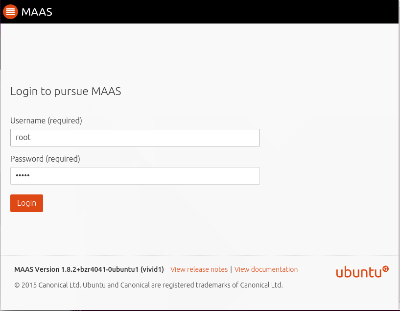

## Import the boot images

Since version 1.7, MAAS stores the boot images in the region controller's
database, from where the cluster controllers will synchronise with the region
and pull images from the region to the cluster's local disk. This process is
automatic and MAAS will check for and download new Ubuntu images every hour.

However, on a new installation you'll need to start the import process
manually once you have set up your MAAS region controller. There are two ways
to start the import: through the web user interface, or through the remote
API.

To do it in the web user interface, go to the Images tab, check the boxes to
say which images you want to import, and click the "Import images" button at
the bottom of the Ubuntu section.

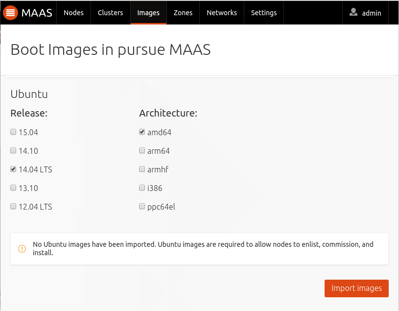

A message will appear to let you know that the import has started, and after a
while, the warnings about the lack of boot images will disappear.

It may take a long time, depending on the speed of your Internet connection
for import process to complete, as the images are several hundred megabytes.
The import process will only download images that have changed since last
import. You can check the progress of the import by hovering over the spinner
next to each image.

The other way to start the import is through the
region-controller API &lt;region-controller-api&gt;, which you can invoke most
conveniently through the command-line interface &lt;cli&gt;.

To do this, connect to the MAAS API using the "maas" command-line client. See
[Logging in][apiauth] for how to get set up with this tool. Then, run the
command:

```bash
maas my-maas-session boot-resources import
```

(Substitute a different profile name for 'my-maas-session' if you have named
yours something else.) This will initiate the download, just as if you had
clicked "Import images" in the web user interface.

By default, the import is configured to download the most recent LTS release
only for the amd64 architecture. Although this should suit most needs, you can
change the selections on the Images tab, or over the API. Read
customise boot sources &lt;/bootsources&gt; to see examples on how to do that.

## Speeding up repeated image imports by using a local mirror

See sstreams-mirror for information on how to set up a mirror and configure
MAAS to use it.

## Configure DHCP

If you want MAAS to control DHCP, you can either:

1. Follow the instructions at cluster-configuration to use the web UI to set
    up your cluster controller.
1. Use the command line interface by first logging in [to the API][apiauth].
   [See the MAAS CLI documentation][maascli] for further details. 

If you are manually configuring a DHCP server, you should take a look at
manual-dhcp

## Configure switches on the network

Some switches use Spanning-Tree Protocol (STP) to negotiate a loop-free path
through a root bridge. While scanning, it can make each port wait up to 50
seconds before data is allowed to be sent on the port. This delay in turn can
cause problems with some applications/protocols such as PXE, DHCP and DNS, of
which MAAS makes extensive use.

To alleviate this problem, you should enable [Portfast][portfast] for Cisco
switches or its equivalent on other vendor equipment, which enables the ports
to come up almost immediately.

## Traffic between the region contoller and cluster controllers

Each cluster controller must be able to:
- Initiate TCP connections (for HTTP) to each region controller on port
  80 or port 5240, the choice of which depends on the setting of the
  MAAS URL.
- Initiate TCP connections (for RPC) to each region controller between
  port 5250 and 5259 inclusive. This permits up to 10 `maas-regiond`
  processes on each region controller host. At present this is not
  configurable.

Once everything is set up and running, you are ready to start
[enlisting nodes][addnodes].

<!-- LINKS -->
[maasppastable]: https://launchpad.net/~maas/+archive/ubuntu/stable
[maasppanext]: https://launchpad.net/~maas/+archive/ubuntu/next
[apiauth]: ./api-authentication.md
[maascli]: ./manage-cli.md
[portfast]: https://www.symantec.com/business/support/index?page=content&id=HOWTO6019
[addnodes]: ./nodes-add.md
