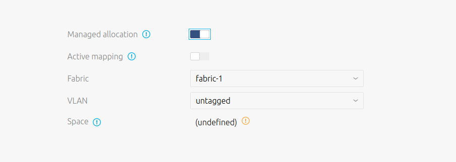

Title: Subnet Management | MAAS

# Subnet Management 

The topic of subnet management pertains to whether MAAS is in full control of a
subnet or not. By default, a subnet is *managed* by MAAS but the administrator
has the option of disabling this mode.

## Managed subnets

When management is enabled for a subnet, MAAS will:

- Lease addresses for DHCP from a *reserved dynamic IP range*
- Assign static addresses not included in a *reserved IP range*, typically via
  'Auto assign' IP allocation mode for a node.

See
[Concepts and terms](intro-concepts.md#ip-ranges)
for an explanation of the two kinds of reserved IP ranges MAAS uses and
[Post-commission configuration](installconfig-commission-nodes.md#post-commission-configuration)
on IP allocation modes.

## Unmanaged subnets

When management is disabled for a subnet, the definition of a *reserved IP
range* differs from the managed mode. Here, a *reserved IP range* tells MAAS to
**only allocate addresses from this range** (via 'Auto assign'). In addition,
DHCP will never lease addresses from an unmanaged subnet.

## Controlling subnet management

To disable (or re-enable) subnet management navigate to the 'Subnets' page and
select the subnet. There is a slide switch labelled 'Managed allocation'. Click
the label (or the switch icon itself) to toggle between enabled (green) and
disabled.

See [MAAS CLI](manage-cli-common.md#control-subnet-management) for how to do this
with the CLI.

## IP address tracking

MAAS will keep track of all assigned addresses, regardless of whether they come
from managed or unmanaged subnets.
