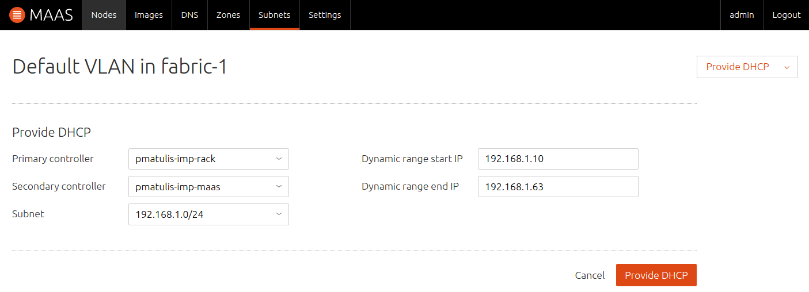
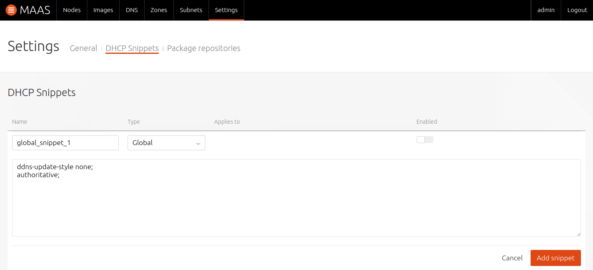

Title: DHCP | MAAS
TODO:  Maybe create a bug for why the enablement of DHCP in the web UI asks for a gateway IP and not a nameserver
table_of_contents: True

# DHCP

MAAS enlists and commissions nodes through the use of its own DHCP server
running on an untagged VLAN. Although this *MAAS-managed DHCP* can also be
part of the deploy phase, an *external DHCP server* can optionally be used
instead for this purpose (on a tagged VLAN). If MAAS detects an external DHCP
server it will display it on the rack controller's page ('Nodes' page >
'Controller' tab > select rack controller) in the web UI.

Normally the machine subnet is on the untagged VLAN, but if this is not the case
then DHCP packets will need to be specially routed between the subnet and the
MAAS-provided DHCP subnet. It is also possible to relay DHCP from one VLAN to
another using an external DHCP relay.

Using an external DHCP server for enlistment and commissioning may work but
this is not supported. By doing so you also forfeit the IP management ability
of MAAS since synchronization (e.g. notifications that leases should be
squashed when a node is returned to the pool) between it and the DHCP server
will be severed. [High availability](./manage-maas-ha.md) is also dependent
upon MAAS-managed DHCP.

**This documentation presupposes that MAAS-managed DHCP is used to enlist and
commission nodes.**

Required reading before continuing:

- [Concepts and terms](intro-concepts.md#ip-ranges) for an explanation of
  reserved IP ranges
- [Commission nodes](installconfig-commission-nodes.md#post-commission-configuration)
  for an explanation of IP assignment modes

## Enabling DHCP

A *reserved dynamic IP range* is needed in order for MAAS-managed DHCP to at
least enlist and commission nodes and the creation of such a range is part of
the process of enabling DHCP with the web UI. See
[MAAS CLI](manage-cli-common.md#enable-dhcp) for doing this with the CLI.

To enable MASS-managed DHCP, under the 'Subnets' page select the desired VLAN
and then:

1. Under the 'Take action' button select 'Provide DHCP'. A new window will
appear.
1. Select the primary rack controller. For DHCP HA, select both the primary
and the secondary.
1. Create a reserved dynamic IP range. Fill in the fields 'Dynamic range start
IP' and 'Dynamic range end IP'.
1. Apply your changes with the 'Provide DHCP' button.

Now, addresses in this range will get assigned to machines that are being
either enlisted or commissioned.

In addition, if a node being deployed has an interface connected to the
untagged VLAN and it has an IP assignment mode set to 'DHCP' then it will also
get an address in this range.

## Enabling DHCP via relay

To enable DHCP on another VLAN and relay from the current VLAN the 'Relay DHCP'
action is chosen instead of the 'Provide DHCP' action.

## Extending a reserved dynamic IP range

If necessary, it is possible to add further portions of the subnet to the
dynamic IP range (see
[Reserved IP addresses](installconfig-subnets-ipranges.md) ). Furthermore,
since DHCP is enabled on a VLAN basis and a VLAN can contain multiple subnets,
it is possible to add a portion from those subnets as well. Just select the
subnet under the 'Subnets' page and reserve a dynamic range. DHCP will be
enabled automatically.

## External DHCP and a reserved IP range

If an external DHCP server will be used to deploy machines then a *reserved IP
range* should be created to prevent the address namespace from being corrupted.
For instance, address conflicts may occur if a node's IP assignment mode is set
to 'Auto assign' in the context of an external DHCP server. See
[Reserved IP addresses](installconfig-subnets-ipranges.md) to create such a
range. It should correspond to the lease range of the external server.

## DHCP Snippets

When DHCP is managed from within MAAS, it can be customized through the use of
*DHCP snippets*. These are user defined configuration options that can be
applied either globally, per subnet, or per node. A global snippet is applied
to all VLANs, subnets, and nodes. All three types end up in
`/var/lib/maas/dhcpd.conf` or `/var/lib/maas/dhcpd6.conf`. For information on
what options to use refer to the
[`dhcpd.conf` man page](http://manpages.ubuntu.com/cgi-bin/search.py?q=dhcpd.conf).

!!! Note: Modifications made directly to `dhcpd.conf.template` or `dhcpd6.conf.template` are
not supported.

To manage snippets, as an admin, open the 'Settings' page and click on the
'DHCP Snippets' tab.

See [MAAS CLI](manage-cli-dhcp-snippets.md) for doing this with the CLI.
