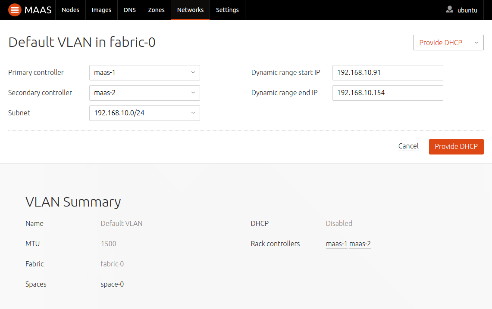
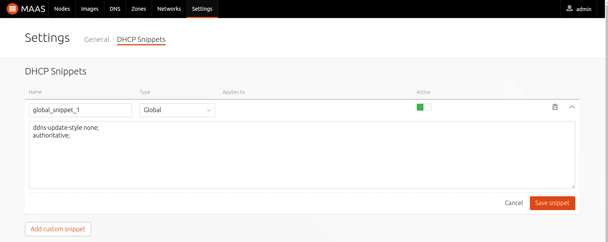

Title: DHCP

# DHCP

In order for MAAS to enlist and commission machines, it needs to provide its
own DHCP server on an untagged VLAN. Although a MAAS-managed DHCP service can
also be part of the deploy phase, an external DHCP server can optionally be
used instead for this purpose (on a tagged VLAN).
 
Normally the machine subnet is on the untagged VLAN, but if this is not the case
then DHCP packets will need to be specially routed between the subnet and the
MAAS-provided DHCP subnet. 

It may be theoretically possible to use an external DHCP server for enlistment
and commissioning but this is not supported. By doing so you also forfeit the
IP management ability of MAAS since synchronization (e.g. notifications that
leases should be squashed when a node is returned to the pool) between it and
the DHCP server will be severed. [High availability](./manage-maas-ha.md) is
also dependent upon MAAS-managed DHCP.

**This documentation assumes that MAAS-managed DHCP is being used to enlist and
commission nodes.**

## Competing DHCP

Enabling your own DHCP server that competes with one that's being managed by
MAAS can cause serious disruption. Make sure you understand the implications of
running a DHCP server before doing this. If MAAS detects external DHCP servers
on its networks, it will display them on the rack controller's page ('Nodes'
page > 'Controller' tab > select rack controller) in the web UI.

## Reserved dynamic IP ranges

A *reserved dynamic IP range* is needed in order for MAAS to provide DHCP for
machines. The creation of such a range is part of the process of enabling DHCP
via the web UI (see below) so do not create one in advance. See
[Concepts and terms](intro-concepts.md#ip-ranges) for an explanation of
reserved IP ranges used in MAAS.

Addresses in this range **always** get assigned to machines that are being:

- auto-registered (also called enlisted)
- commissioned

If a machine being **deployed** has been configured to use DHCP then
an address in this range will also be used. See
[Commission nodes](installconfig-commission-nodes.md#post-commission-configuration)
for IP assignment modes other than DHCP.

## Enabling DHCP

Under the 'Networks' tab choose a VLAN and enable DHCP:

1. Under the 'Take action' button select 'Provide DHCP'. A new window will
appear.
1. Select the primary rack controller. For DHCP HA, select both the primary
and the secondary.
1. Create a reserved dynamic IP range. Fill in the fields 'Dynamic range start
IP' and 'Dynamic range end IP'.
1. Configure a default gateway. Fill in the field 'Gateway IP'.
1. Apply your changes with the 'Provide DHCP' button.

See [MAAS CLI](manage-cli-common.md#enable-dhcp) for doing this with the CLI.

If necessary, it is possible to add further portions of the subnet to the
dynamic IP range (see
[Reserved IP addresses](installconfig-subnets-ipranges.md)
). Furthermore, since DHCP is enabled on a VLAN basis and a VLAN can contain
multiple subnets, it is possible to add a portion from those subnets as well.
Just select the subnet under the 'Networks' tab and reserve a dynamic range.
DHCP will be enabled automatically.

## DHCP Snippets

When DHCP is managed from within MAAS, it can be customized through the use of
*DHCP snippets*. These are user defined configuration options that can be
applied either globally, per subnet, or per node. A global snippet is applied
to all VLANs, subnets, and nodes. All three types end up in
`/var/lib/maas/dhcpd.conf` or `/var/lib/maas/dhcpd6.conf`. For information on
what options to use refer to the
[`dhcpd.conf` man page](http://manpages.ubuntu.com/cgi-bin/search.py?q=dhcpd.conf).

!!! Note: This feature is available in MAAS versions 2.0 and above.
Modifications made directly to `dhcpd.conf.template` or `dhcpd6.conf.template` are
no longer supported.

To manage snippets, as an admin, open the 'Settings' page and click on the
'DHCP Snippets' tab.

See [MAAS CLI](manage-cli-dhcp-snippets.md) for doing this with the CLI.
