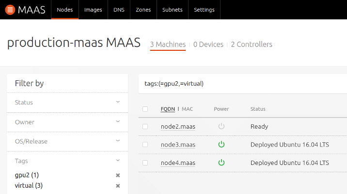
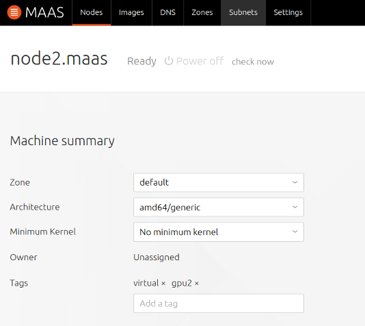
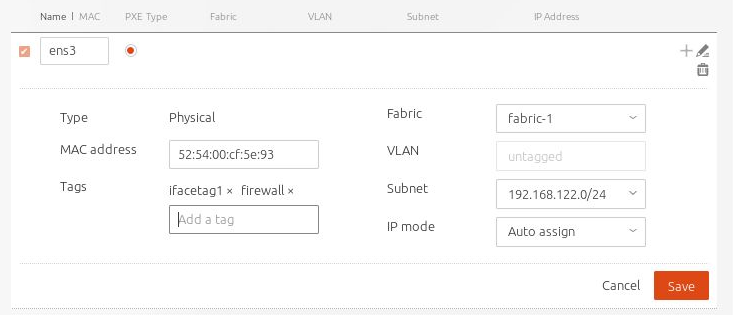

Title: Tags | MAAS
TODO:  Cover how tags are used in the web UI (including XML output for a node)
       Track bug: https://bugs.launchpad.net/maas/+bug/1608629 (UI and tags)


# Tags

MAAS tags are used to identify machines under its control. The main purpose of
tags is to be able to easily deploy services onto machines that meet certain
criteria. 

For instance, a tag could identify nodes which possess fast GPUs. Such a tag
would help if you were planning to deploy software which used GPU-accelerated
CUDA or OpenCL libraries. 

Because MAAS was designed to work well with
[Juju](https://jujucharms.com/docs/devel/about-juju.html), the latter supports
MAAS tags for application deployments. Juju is the recommended way to deploy
services onto machines managed by MAAS.

!!! Note: Newly-created tags immediately become available as a filter in the
'Nodes' tab in the web UI. 


## Tag definitions

A *tag definition* is the criteria by which nodes are auto-labelled by the
corresponding tag. During node enlistment MAAS collects hardware information
(using the [lshw](http://ezix.org/project/wiki/HardwareLiSter) utility). The
definition used in creating a tag is then constructed using an *XPath
expression* based on that information. See
[w3schools documentation](http://www.w3schools.com/xsl/xpath_intro.asp) for
details on XPath. 

The collected data for each node, viewaable (in both XML and YAML) in the web
UI, is inspected by you for the desired property. Building on the example
alluded to above, a property can be a GPU with a clock speed greater than 1GHz.
In this case, the following excerpt from a node's data (in XML format) is
pertinent:

```nohighlight
      <lshw:node id="display" class="display" handle="PCI:0000:00:02.0">
       <lshw:description>VGA compatible controller</lshw:description>
       <lshw:product>GD 5446</lshw:product>
       <lshw:vendor>Cirrus Logic</lshw:vendor>
       <lshw:physid>2</lshw:physid>
       <lshw:businfo>pci@0000:00:02.0</lshw:businfo>
       <lshw:version>00</lshw:version>
       <lshw:width units="bits">32</lshw:width>
       <lshw:clock units="Hz">33000000</lshw:clock>
       <lshw:configuration>
        <lshw:setting id="latency" value="0"/>
       </lshw:configuration>
       <lshw:capabilities>
        <lshw:capability id="vga_controller"/>
       </lshw:capabilities>
       <lshw:resources>
        <lshw:resource type="memory" value="fc000000-fdffffff"/>
        <lshw:resource type="memory" value="febd0000-febd0fff"/>
        <lshw:resource type="memory" value="febc0000-febcffff"/>
       </lshw:resources>
      </lshw:node>
```

MAAS nodes will be selected based on these XPath *predicates*:

- *element* of 'node'
- with an *attribute* of 'id'
- whose *value* is 'display'
- and has a *child element* of 'clock units="Hz"'

After adding the speed criteria via an XPath *operator* we end up with this as
our tag definition:

```nohighlight
//node[@id="display"]/'clock units="Hz"' > 1000000000
```

This definition is used in a CLI example
[here](manage-cli-tags.md#tag-creation-and-auto-assignment).


## Tag listing and tags as search filters

To list all tags visit the 'Nodes' tab and expand the 'Tags' subsection in the
left pane.

This view is also where one can use tags as node search filters. Select one, or
several, tags. The nodes that satisfy all selected tags will display on the
right pane. Notice there is a search field at the top of the right pane. This
is where one can type in a search expression.

Below, tags 'gpu2' and 'virtual' have been selected by mouse-clicking. The
search field automatically reflects this. Three nodes satisfy this search
filter (they have either of these tags).



Remove a tag from the search filter by either hitting the 'x' character
alongside a tag or editing the search expression.


## Tag assignment

To view a node's currently assigned tags stay on the 'Nodes' page and select
the node in question. Tags that are currently assigned will be displayed.

The following three actions are done while in a node's edit mode (click the
'Edit' button). Changes are saved by pressing the 'Save changes' button.

- To unassign a tag hit the 'x' character alongside a tag.
- To create a rudimentary tag type the name of the new tag in the 'Add a tag'
  field and hit Enter. The tag will be created and automatically assigned to the
  node. Repeat if desired.
- To assign an existing tag type at least three characters to trigger a
  real-time search. Any resulting tags will show up in a drop-down menu.
  Select as desired.



### Tags for network interfaces

Alongside tags for an entire node, it's also possible to assign tags to
specific network interfaces. These tags can be used when searching for nodes
within the web UI and when allocating machines from the API. 

Network interface tags can only be assigned when a node is in either a 'Ready' or
a 'Broken' state. With the machine selected from the 'Nodes' tab, find the
'Interfaces' section and use the 'Edit' button on the far right of a listed
interface to expand its details. To add a tag, enter its name into the 'Add a
tag' field. Use the small 'x' next to a tag to unassign it.




## Tag management

With the exception of tag assignment (as shown above), at this time tag
management, such as creation, deletion, and advanced operations, can only be
performed via the CLI. See [MAAS CLI](manage-cli-tags.md) for tag
management. Also covered there is how to use tags in conjunction with Juju (to
deploy services) and all tag features available with the web UI (listing and
searching).

As was shown in the above section, rudimentary tag creation *is* possible in the
web UI but such tags lack any intelligence. They should be regarded more as node
aliases.
