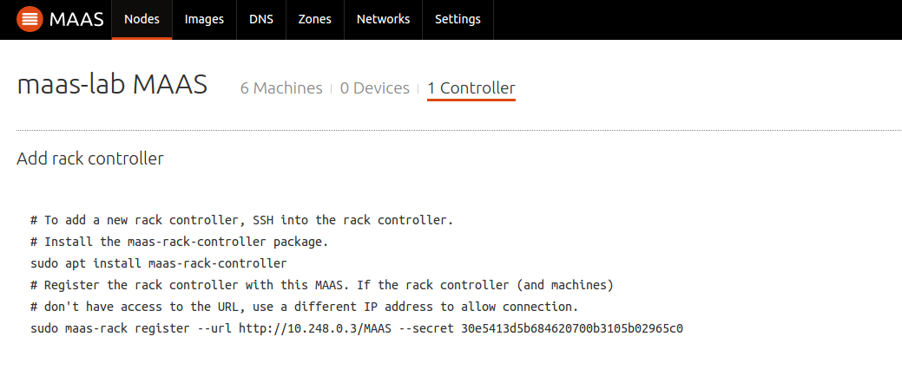

Title: MAAS CLI | Advanced Tasks
TODO:  Decide whether explicit examples are needed everywhere
       Foldouts cannot be used due to bug: https://git.io/vwbCz
       Update installconfig-tags.html to show assigning tags to machines with UI; then link to it (for entry 'specify boot option') 
       Confirm whether kernel boot options really override default/global options such as those given by GRUB's GRUB_CMDLINE_LINUX_DEFAULT variable
       Bug check: https://goo.gl/cnNy8L - remove Note and change image (and possibly the example command) when resolved (installconfig-rack__add-controller.png)


# Advanced CLI Tasks

This is a list of advanced tasks to perform with the MAAS CLI. See
[MAAS CLI](manage-cli.md) on how to get started.


## Set the default kernel boot options

To set kernel boot options that will be applied to all machines:

```bash
maas $PROFILE maas set-config name=kernel_opts value='$KERNEL_OPTIONS'
```

## Specify kernel boot options for a machine

To specify kernel boot options for an individual machine a tag needs to be
created:

```bash
maas $PROFILE tags create name='$TAG_NAME' \
	comment='$COMMENT' kernel_opts='$KERNEL_OPTIONS'
```

For example:

```bash
maas $PROFILE tags create name='nomodeset' \
	comment='nomodeset kernel option' kernel_opts='nomodeset vga'
```

The tag must then be assigned to the machine in question. This can be done
with the web UI or with the CLI. For the latter, see
[assign a tag to a node](manage-cli-common.md#assign-a-tag-to-a-node).

If multiple tags attached to a node have the `kernel_opts` defined, the first
one (ordered alphabetically) is used.


## Set a default minimum HWE kernel

To set a default minimum HWE kernel for all machines:

```bash
maas $PROFILE maas set-config name=default_min_hwe_kernel value=$HWE_KERNEL
```


## Set a minimum HWE kernel for a machine

To set the minimum HWE kernel on a machine basis:

```bash
maas $PROFILE machine update $SYSTEM_ID min_hwe_kernel=$HWE_KERNEL
```


## Set a specific HWE kernel during machine deployment

To set a specific HWE kernel during the deployment of a machine:

```bash
maas $PROFILE machine deploy $SYSTEM_ID distro_series=$SERIES hwe_kernel=$HWE_KERNEL
```

MAAS verifies that the specified kernel is available for the given Ubuntu
release (series) before deploying the node. 


## Update node hostname and power parameters

To update the hostname and power parameters of a (KVM) node based on its
system ID:

```bash
maas $PROFILE machine update $SYSTEM_ID \
	hostname=$HOSTNAME \
	power_type=virsh \
	power_parameters_power_address=qemu+ssh://ubuntu@$KVM_HOST/system \
	power_parameters_power_id=$HOSTNAME
```

## Install a rack controller

To install and register a rack controller with the MAAS:

```bash
sudo apt install maas-rack-controller
sudo maas-rack register
```

!!! Note: The register command is only needed if the rack controller is not
being added to a system that already houses an API server.

You will be asked for the URL of the region API server. If you provide a
hostname ensure it is resolvable. Next, you will be prompted for the secret key
that is stored in file `/var/lib/maas/secret` on the API server.

You can get the above information from the web UI by visiting the 'Nodes' tab,
then the Controller sub-tab, and clicking the button 'Add rack controller'.
Here is an example of what you may see:



Based on the above, then, we could have also entered:

```bash
sudo maas-rack register --url http://10.248.0.3:5240/MAAS --secret 30e5413d5b684620700b3105b02965c0
```

!!! Note: The web UI example does not refer to port 5240 but this should be
fixed soon.
